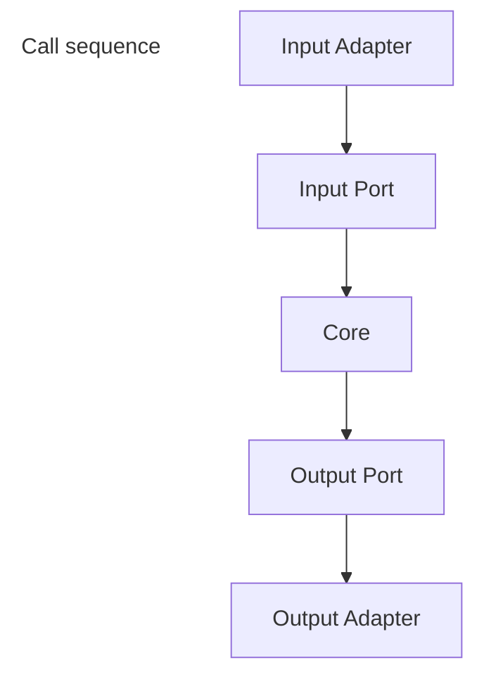

# Welcome to the ClubExample Project 🎉

**Congratulations! You’ve just inherited some code.**  

Yes, legacy code… but don’t worry, it’s your playground to practice modern architecture and have a little fun. 😎

---

## About This Project

- Classic **anaemic domain** with `Club`, `Member`, and `Subscription`.  
- Business logic lives mostly in services or procedural code.  
- Data access is tightly coupled to domain objects — raw CRUD everywhere.  
- A charming mess, just like a real-world legacy system.  

***With this anaemic architecture, change is painful. Our **primary goal** is to isolate the business logic so that it is independent and easy to maintain.*** 
---

## Project Goals

- Refactor the system into **hexagonal architecture (Ports & Adapters)**.  
- Keep the **Core** clean: domain entities + input/output ports.  
- Implement **driving adapters** like Web API.  
- Implement **driven adapters** like PostgreSQL, Redis, and Pulsar.  
- Make core logic independent of infrastructure.  
- Grab the transversal know-how: master YARP & OpenTelemetry to trace and route like a pro!
- Say goodbye to the anaemic Model! Master powerful, business-logic-driven domain design.

---

## Learning Outcomes

- Spot the difference between **anaemic vs rich domain models**.  
- Apply **hexagonal architecture principles** in practice.  
- Handle **transactions, persistence, and relationships** cleanly.  
- Transform legacy chaos into a **clean, testable, maintainable system**.  

---

## Fun Facts

- You are now the proud owner of **legacy code inheritance**. 🏰  
- This is your chance to become a **refactoring hero**. 🦸‍♂️  
- Hexagonal architecture is your **magic shield** against messy dependencies. 🛡️  
- Every adapter you implement is like adding a **new power-up** to the system. ⚡  
- Beware: the journey from anaemic to rich domain is full of **fun bugs and learning opportunities**. 🐛  

---

> Embrace the chaos, wield the ports and adapters wisely, and become a master of hex code! 🚀

Happy Refactoring! 🎨👨‍💻👩‍💻

## Hexagonal Architecture Overview (Ports & Adapters) 🏛️

Hexagonal Architecture, also known as **Ports & Adapters**, is a software design pattern that **isolates the core domain logic from external concerns**, such as databases, messaging, or user interfaces.  
It allows your application to evolve independently of frameworks, infrastructure, or delivery mechanisms.

---

## Core Concepts

### 1. Ports
Ports define the **interfaces** that the core domain uses to communicate with the outside world.  
They act as **contracts**, not implementations.

- **Input Ports (Driving Ports)**  
  - Represent actions or use cases initiated **from the outside**, e.g., Web API, CLI, scheduled jobs.  
  - Implemented by **use case classes** in the Core.  
  - Example: `RegisterMember`, `ExtendSubscription`.

- **Output Ports (Driven Ports)**  
  - Represent operations **that the core delegates to external systems**, e.g., databases, messaging, cache.  
  - Core defines the **interface**, adapters implement it.  
  - Example: `IClubRepository`, `IMemberRepository`, `IEventPublisher`.

### 2. Adapters
Adapters provide the **concrete implementations of ports**.

- **Driving Adapters**  
  - Trigger input ports.  
  - Examples: REST API controllers, gRPC endpoints, CLI commands.

- **Driven Adapters**  
  - Implement output ports to interact with external systems.  
  - Examples: PostgreSQL repository, Redis cache, Pulsar publisher.

---

## Principles / Rules

1. **Dependency Inversion**  
   - Core depends only on interfaces (ports), not on concrete implementations.  

2. **One-way Dependency**  
   - Flow of control always goes from the adapter to the core (input) or core to adapter (output).  

3. **Testability**  
   - Core can be tested in isolation using mock implementations of output ports.  

4. **Replaceable Adapters**  
   - Infrastructure can be swapped without changing core logic.  

5. **Encapsulate Business Rules**  
   - Core contains all business rules; adapters contain only technical details.

---

## Diagram



# Hexagonal Architecture Example: CreateSport ⚽🏀🎾

Let’s have a chill example to understand how hexagonal architecture works.  
We’ll use a simple `Sport` entity and a `CreateSport` use case.  
We’ll skip EF or any real database; the goal is to show **ports and adapters** clearly.

-----

## Domain Anaemic Entity

```csharp
public class Sport
{
    public Guid Id { get; set; }
    public string Name { get; set; }
}
```

## Input Port interface

```csharp
public interface ICreateSport
{
    Task ExecuteAsync(string name);
}
```

## Input port implementation (Use Case)

```csharp
public class CreateSportUseCase : ICreateSport
{
    private readonly ISportRepository _repository;

    public CreateSportUseCase(ISportRepository repository)
    {
            _repository = repository;
    }

    public async Task ExecuteAsync(string name)
    {
            var sport = new Sport
            {
                Id = Guid.NewGuid(),
                Name = name
            };

            await _repository.InsertAsync(sport);
    }
}
```

## Output Port interface (Repository interface)

```csharp
public interface ISportRepository
{
    Task InsertAsync(Sport sport);
}
```

## Driven Adapter implementation (In-Memory Repository)

```csharp
public class InMemorySportRepository : ISportRepository
{
    private readonly List<Sport> _sports = new();

    public Task InsertAsync(Sport sport)
    {
        _sports.Add(sport);
        Console.WriteLine($"Sport '{sport.Name}' created with Id {sport.Id}");
        return Task.CompletedTask;
    }
}
```

## Driver Adapter (Console App)

```csharp
// 1️⃣ Configure DI container - only for demonstration purposes
var serviceProvider = new ServiceCollection()
 .AddSingleton<ISportRepository, InMemorySportRepository>() // Maybe this code should be in the adapter
 .AddSingleton<ICreateSport, CreateSportUseCase>()           // Maybe this code should be in the core
 .BuildServiceProvider();

// 2️⃣ Resolve the use case from DI
var createSport = serviceProvider.GetRequiredService<ICreateSport>();

// 3️⃣ Use the use case
await createSport.ExecuteAsync("Soccer");
await createSport.ExecuteAsync("Basketball");

```

### 🚨 Adaptation Required

The training modules that will forge you into a Hexagonal master are locked in the `docs/exercises/` directory.
Create a fork of this repository and complete the exercises to unlock the full potential of Hexagonal Architecture in your projects. Put each exercise code in its own branch.


Core training modules include:

  - [Exercise 01: Foundational architecture](docs/Exercises/Exercise01_RegisterMemberUseCase.md)
  - [Exercise 02: Composition and hosting](docs/Exercises/Exercise02_addHost.md)
  - [Exercise 03: Persistence and Consistency](docs/Exercises/Exercise03_UnitOfWork.md)

-----

## 🛰 Expanding Input: Adding gRPC as a Second Driving Adapter

So, you’ve survived your first round with Hexagonal Architecture.  
You’ve created ports, adapters, and maybe even had an existential crisis about dependency direction.  
Congratulations — you’re officially dangerous. 🔥

Now that you've seen the Core -> Repository flow, the next step is to connect this to a **real input adapter** (which you'll do in Exercise 01/02), and then add a more advanced one: gRPC.

Now let’s turn things up a notch:  
You have a REST API talking to your Core, but what if another service wants to call your system — and it speaks fluent gRPC?

Good news: you don’t need to rewrite your Core.  
You just add another **Input Adapter**, and voilà — your architecture welcomes a brand-new protocol without breaking a sweat.

-----

### 💬 What the Heck Is gRPC?

**gRPC** (pronounced “jee-are-pee-see”) is a fancy Remote Procedure Call framework created by Google.  
Think of it as a more efficient, strongly typed cousin of REST — built on **HTTP/2** and **Protocol Buffers (protobuf)**.

Here’s why it’s awesome:

  - 🚀 Blazing fast (binary serialisation, multiplexing, and compression FTW)  
  - 🔐 Strong typing with `.proto` contracts  
  - 🧩 Contract-First design (no more guessing what the API expects)
  - 💬 Bi-directional streaming support (yep, real-time communication)  
  - ⚙️ Native integration with .NET and ASP.NET Core  
  - 💪 Auto-generated client and server code — less boilerplate, more brainpower and be contract-first

In other words, gRPC lets your services chat with each other **like pros**, without the JSON overhead.

-----

### 🧩 How gRPC Fits Like a Glove in Hexagonal Architecture

#### 1\. It’s Just Another Input Adapter

If REST is your friendly neighbourhood web API, gRPC is its ultra-efficient cousin with a rocket engine.  
You define your gRPC service, and it calls your **Input Port** in the Core.  
The Core doesn’t even blink — it still talks to interfaces, not technologies.

#### 2\. Your Core Remains Untouched (and Pure)

No matter how many new protocols you throw in — REST, gRPC, GraphQL, Morse code —  
Your Core doesn’t care.  
It’s like:  

> “As long as you call my ports correctly, we’re good.”

That’s the beauty of Hexagonal Architecture — **you isolate technology from business logic**.

#### 3\. New Protocol? No Problem.

Adding gRPC doesn’t mean replacing REST.  
It means **expanding** your system’s reach.  
You can have:

  - REST for browser clients  
  - gRPC for internal microservices  
  - Pulsar or Kafka for async events  
    All calling the *same* Core use cases.  
    No drama, no duplication — just pure modular bliss. 🧘

### 4\. But... There’s Always a But.

The change from REST to gRPC isn’t just a copy-paste job.
 - It is not as human-friendly as like REST; the messages are binary-encoded.
 - gRPC Web clients need special support (not all browsers do gRPC natively). Maybe you need a Backend-for-Frontend (BFF) pattern.
 - Change in your status codes and error handling (gRPC has its own set of status codes).
 
Last, but not least, let me explain the biggest issue, and it's the tools. The main drag about gRPC tools is that they’re still playing catch-up to the glorious, user-friendly world of REST APIs (where Postman reigns supreme).
The big "oopsie" here is **gRPC Reflection**. It's like your service wearing a badge that says, "Hey, here’s my entire secret menu, code structure, and everything I can do!"
In Dev, that’s great, you just point your funky gRPC client (like gRPCurl) at it and it instantly knows how to talk. But **if you accidentally leave that badge on in Production, you’re basically an open book**. An attacker gets a free roadmap, making your system much easier to poke and prod. Technically speaking, it's an attack surface error that can ultimately **lead to brute-force attacks and a potential Distributed Denial of Service (DDoS)**.

So, that is the trade-off: **convenient testing tools often rely on a feature that is a huge security risk in the real world.** We love the easy button, but we can't let it expose our whole kitchen!

If you get why leaving Reflection turned on in production is a massive security blunder, you'll immediately grasp just how sensitive those `.proto` files really are. **Do yourself a favour: avoid dumping them into public, open-source repos.**

-----

### 🧠 The Core Lesson

> The Core should never care *how* it’s being called — only *what* is being asked.  

Adding gRPC is proof that your architecture is paying off. You’re extending functionality without breaking a single line of business logic.

Each new protocol lives in its own adapter (for example, `Adapter.Grpc`),  and the **Host** just wires them up like friendly neighbours at a block party.

-----

### 🎓 Learn More

If you want to dig deeper — and you should — here are some solid resources:

- 🧾 [Introduction to gRPC on .NET – Microsoft Docs](https://learn.microsoft.com/en-us/aspnet/core/grpc/?view=aspnetcore-9.0)  
- 🛠️ [Create a gRPC client and server in ASP.NET Core](https://learn.microsoft.com/en-us/aspnet/core/tutorials/grpc/grpc-start?view=aspnetcore-9.0)  
- 🎥 [YouTube Playlist: Intro to gRPC in C#](https://www.youtube.com/playlist?list=PLzewa6pjbr3IOa6POjAMM0xiPZ-shjoem)
- 🎥 [YouTube: The best video about gRPC contracts](https://www.youtube.com/watch?v=LSkR7ynLYdc)  

----

### 🚨 Adaptation Required - gRPC, Distributed Cache and Messaging

Please, follow the instructions below to continue your training:

* 🧩 [Create a gRPC adapter](Docs/Exercises/Exercise04_addgRPC.md)
* ⚡ [Add a distributed cache port](Docs/Exercises/Exercise05_addDistributedCachePort.md)
* 📬 [Add a messaging output](Docs/Exercises/Exercise06_addPublisherPort.md)

No heavy theory on cache or messaging — active developers already possess this transversal knowledge.
Just dive straight into the implementation! 💪

By the end of these exercises, you’ll have conquered the **holy trinity of microservice infrastructure**:
database, distributed cache, and messaging.
**Three adapters to rule them all.** 🔥

---

A wise observation, young architect — but your journey is far from over.
Darker patterns await: **CQRS, reverse proxies, telemetry…**
So don’t celebrate just yet, for the road to **hexagonal mastery** is long and full of abstractions. ⚔️

----

## Implementing CQRS with Hexagonal Architecture ⚡

You’ve mastered the basics of Hexagonal Architecture. Now it’s time to level up with **CQRS** (Command Query Responsibility Segregation).

### ⚠️ CQRS Disclaimer (but let’s not get too fancy)

Before you get too excited: **this is NOT real CQRS** (yet 😅).  
For now, we’re working with **a single database**, even though we have **two hosts** and **a shared core**.  
The idea is to get a **first hands-on feel of CQRS principles** without spinning up half the cloud just to test a concept.

Think of this as a **dress rehearsal**: we’re separating **commands** and **queries** into **different hosts**, but **under the hood, everything still points to the same engine** 🧠💾.  

This approach is often used as an **intermediate step** before fully splitting into two independent hosts — each with its own logic and model.  
It works as a kind of **meaningful load test**:  
👉 to see whether it’s **worth investing in more hardware** (or more database services if you’re in the cloud),  
👉 or if **this level of separation already gives us acceptable performance** without multiplying costs.  

In a more advanced setup, the *read model* could even have **its own document database** and the two models would communicate **through events** using a messaging service.  
But that’s a story for another day (and another invoice 💸).

-----

### 💡 Alternative approach: Materialized Views

Another common approach at this stage — especially when queries start eating too many database resources — is to use **materialized views**.  
Instead of recalculating complex joins or aggregations every time, you **precompute the view** and store it as a table.  

The trick here is that **every time an entity changes** (and that change affects the view), you trigger a domain event, and in the handler of this event, execute a **“refresh view” command**.  
That keeps the read model in sync without hammering the database on every request.

It’s not as fancy as full-blown CQRS with separate models and event streams, but it can **dramatically improve performance** while keeping your setup **simple and cost-effective** — and your ops team a little less angry 😅.

-----

> “Real CQRS is cool, but keeping the database alive is cooler.” 😂

-----

### 🚨 Adaptation Required
You are not going deeper into CQRS theory here, as it's covered in another module. [In this exercise](Docs/Exercises/Exercise07_CQRS.md), you'll create two separate hosts (Query/Command) sharing one database and configure Docker Compose to run multiple instances for horizontal scaling.


## 🧩 Reverse Proxy + CQRS: A Friendly Intro

So, picture this: you’ve got two hosts — one handling **commands** (writes) and the other handling **queries** (reads).  
You’re still sharing a single database, but starting to shape the idea of a true **CQRS-style separation**.  
Now you want one entry point to route traffic to the right side without confusing clients or duplicating endpoints.  
Enter our hero: **the reverse proxy**.

-----

### 🕹️ What’s a Reverse Proxy?

A **reverse proxy** is a service that sits between clients and your backend.  
It receives all incoming requests and decides **where** to send them.  
Once the backend responds, the proxy passes that response back to the client.  

Think of it as your **backend traffic controller** — a single door that hides all the messy internals.

#### Why use one?

  - **Routing:** Decide which backend handles which request (by path, headers, etc).  
  - **Load balancing:** Spread the load across multiple servers.  
  - **Security:** Hide internal services and simplify SSL/TLS handling.  
  - **Flexibility:** Swap or move backend services without clients noticing.  
  - **Performance:** Cache, compress, or transform responses before sending them back.  
  - **Versioning / Canary testing:** Route only part of the traffic to new versions.

In short, it’s your **doorman**, **bodyguard**, and **messenger** — all in one.

-----

### 🧱 How a Reverse Proxy Helps in a CQRS Setup

In a CQRS or hexagonal architecture, you eventually split **commands** and **queries** into independent modules, each with its own logic (and later, its own database).  
But while you’re still in the middle of that transition — two hosts, one core, shared DB — a reverse proxy helps you simulate that separation from the outside world.

Here’s how:

1.  **Single entry point:**  
    The proxy becomes the only URL your frontend or API clients talk to.  
    Internally, it routes `/commands/*` requests to the command host and `/queries/*` requests to the query host.

2.  **Hiding the complexity:**  
    Clients don’t need to know how many services you have or where they live — they just call the API.  
    This gives you the freedom to refactor or scale services later.

3.  **Smooth migration path:**  
    When you eventually give each side its own database or event system, the proxy config stays the same — clients won’t notice the internal change.

4.  **Performance control:**  
    You can later add caching rules or redirect heavy query traffic through optimised services (like materialized views or read replicas).

5.  **Security and policy enforcement:**  
    The proxy is a great place to add authentication, rate limits, or request validation before traffic even hits your core apps.

6.  **Monitoring and observability:**  
    A reverse proxy can log, trace, and measure latency across both sides of your CQRS setup — super handy when testing whether this split actually improves performance.

So in short: it lets you **fake full CQRS separation** from the outside, while keeping your current internal simplicity.  
It’s the perfect *“let’s test this before going all in”* setup.

-----

### 🚀 Enter YARP (Yet Another Reverse Proxy)

If you’re using .NET, **YARP** is a gem.  
It’s Microsoft’s open-source toolkit for building powerful, flexible reverse proxies directly in ASP.NET Core.

YARP isn’t just a prebuilt proxy — it’s a **framework** that gives you all the pieces to build your own gateway, perfectly tuned for your architecture.

#### What makes YARP great:

  - **Native .NET integration:** works as ASP.NET Core middleware.  
  - **Configurable routing:** via `appsettings.json` or dynamically in code.  
  - **Load balancing and health checks:** built-in, with pluggable strategies.  
  - **Transforms:** rewrite paths, headers, and responses.  
  - **Hot reload:** You can update the config without redeploying.  
  - **High performance:** built on `HttpClientFactory` and Kestrel.

-----

### 🧰 A Minimal YARP Setup Example

Here’s how simple it can be:

```csharp
var builder = WebApplication.CreateBuilder(args);

builder.Services.AddReverseProxy()
 .LoadFromConfig(builder.Configuration.GetSection("ReverseProxy"));

var app = builder.Build();
app.MapReverseProxy();
app.Run();
```

And in your `appsettings.json`:

```json
{
  "ReverseProxy": {
    "Routes": {
      "commands": {
        "ClusterId": "commandHost",
        "Match": { "Path": "/commands/{**catch-all}" }
 },
      "queries": {
        "ClusterId": "queryHost",
        "Match": { "Path": "/queries/{**catch-all}" }
 }
 },
    "Clusters": {
      "commandHost": {
        "Destinations": { "d1": { "Address": "https://command-api.local/" } }
 },
      "queryHost": {
        "Destinations": { "d1": { "Address": "https://query-api.local/" } }
 }
 }
 }
}
```

With that, your proxy automatically routes traffic:

  * `POST /commands/...` → goes to the command host
  * `GET /queries/...` → goes to the query host

And your clients still only call one API endpoint — clean and future-proof.

-----

### 🧠 How This Fits Your Current Stage

You’re still using one DB and one core, but two hosts. That’s perfect.
YARP lets you:

  * Keep a **single public entry point**, even though you’re experimenting with host separation.
  * Gather **performance data** before deciding to invest in extra databases or messaging infrastructure.
  * Add **policies** (auth, caching, rate limits) centrally.
  * Gradually move towards **true CQRS**, where each host will own its logic and data, and events connect them asynchronously.

So instead of rushing into full-blown microservices, YARP helps you grow **organically** — one proxy route at a time.

Or in short:

> “Fake it till you make it — but with clean routing.” 😄

-----

### 🔗 Recommended Resources (Must-Reads & Must-Watch or Must summarize by AI 🤣)

Here’s a mix of docs, tutorials, and videos to get you from zero to YARP hero:

1.  **[Microsoft Docs]**([https://learn.microsoft.com/en-us/aspnet/core/fundamentals/servers/yarp/yarp-overview](https://learn.microsoft.com/en-us/aspnet/core/fundamentals/servers/yarp/yarp-overview))
    The official YARP documentation.  
    A must-read to understand the basics, configuration options, and advanced features.

2.  **[Video: How To Build an API Gateway for Microservices with YARP]**([https://www.youtube.com/watch?v=UidT7YYu97s](https://www.youtube.com/watch?v=UidT7YYu97s))
    A practical walkthrough of building a YARP-based API gateway.

3.  **[Video: Microservices with Reverse Proxy]**(https://www.youtube.com/playlist?list=PL285LgYq\_FoJu4C55ILz5sQvg3aX88cHY)
    Playlist with four "small" videos - or one large one of more than two hours - where it is explained configuration, cache, load balanceing and oAuth in YARP.

4.  **[How to make canary testing with YARP]**(https://dev.to/leandroveiga/mastering-advanced-routing-and-load-balancing-with-yarp-strategies-code-and-best-practices-5ddh)
    A deep dive into advanced routing and load balancing strategies with YARP, specially useful when you deploy a new version of your services.

### 🚨 Adaptation Required

Please, follow the instructions to [create a YARP reverse proxy](Docs/Exercises/Exercise08_addReverseProxy.md) When you finish, you'll have a single entry point to route traffic to your command and query hosts, no matter how many instances you have running of each.

-----

### 💬 Final Thoughts

YARP gives you a smart way to **experiment with CQRS separation** without going full microservice right away.
It’s lightweight, native to .NET, and powerful enough to handle routing, scaling, and monitoring once you grow.

For now, let the reverse proxy take the spotlight — it’s your architectural stunt double.
Keep iterating, measure performance, and once you’re ready, your CQRS core will already have the perfect stage.

> “A good proxy hides your complexity — and makes you look more organized than you actually are.” 😂

-----

You've divided your system with CQRS and joined it with YARP. **But how do you measure that performance?** How do you know **traffic is being routed correctly?** You need an all-encompassing view of your distributed systems.

## OpenTelemetry. The One Telemetry to Rule Them All

> *“One Telemetry to rule them all,  
> one Telemetry to find them,  
> one Telemetry to bring them all  
> and in the darkness bind them…”* — Probably J.R.R. Tolkien, if he had worked in DevOps.

You’ve built a scalable solution with a CQRS architecture, separate hosts, multiple adapters, and clean Hexagonal Architecture.

Now, it’s time to **see** your system — to trace, log, and measure what’s really happening inside Mordor (also known as production).

Enter **OpenTelemetry**: the all-seeing eye of distributed systems.

### ⚙️ Why OpenTelemetry?

OTel is an open-source framework for **observability**.  
It provides a consistent way to collect metrics, traces, and logs across multiple services and technologies.

It’s the “One Ring” of system visibility:

  - 🪄 **One standard to rule all logs, metrics, and traces.** - 🔍 **One context to find them — across microservices and layers.** - 🧭 **One framework to bring them all together — in a unified view.** - 🕸️ **And in the dashboards bind them — in the realm of Monitoring where the Alerts lie.**

With OTel, you’ll finally be able to see *what actually happens* when your API calls your Core, your Core calls PostgreSQL, and PostgreSQL decides to take a coffee break.

-----

### 🧠 Core Concept: Context Propagation

OTel relies on **context propagation** — the idea that one trace context (started by the API) follows the request all the way down the stack.

This means:

  * The API adapter starts a span when it receives a request — or an Activity, if you speak fluent Microsoft, who never met a standard they couldn’t rename.
  * The **Core** reuses the same context when executing use cases.
  * The **Output Adapters** (like PostgreSQL or Redis) log spans inside that same trace.

When viewed in a tracing tool (like Jaeger or .Net Aspire), you’ll see a single timeline — from request to database write to event publishing. 🕵️‍♀️

-----

### 🧰 Automatic Instrumentation

This section covers what OpenTelemetry instruments automatically without manual code changes.

### ⚙️ Exporters & Configuration

Without change any line of code, OpenTelemetry can automatically instrument many common libraries and frameworks.

The OTel packages are split in two main categories, Instrumentations and Exporters. Instrumentations are responsible for creating spans for common operations, some of them are:

  - Host - handled by `OpenTelemetry.Extensions.Hosting`
  - ASP.NET Core (incoming HTTP/gRPC requests) - handled by `OpenTelemetry.Instrumentation.AspNetCore`
  - HttpClient (outgoing HTTP calls) - handled by `OpenTelemetry.Instrumentation.Http`
  - EF Core (database queries) - handled by `OpenTelemetry.Instrumentation.EntityFrameworkCore`
  - PostgreSQL (DB calls via Npgsql) - handled by `OpenTelemetry.Instrumentation.Npgsql`
  - Redis (cache operations) - handled by community packages like `OpenTelemetry.Instrumentation.StackExchangeRedis`

On the other hand, Exporters send the collected telemetry data to a collector tool (like Jaeger, .Net Aspire, or a console). The most common exporters are:

  - OTLP, the official Open telemetry protocol - handled by `OpenTelemetry.Exporter.OpenTelemetryProtocol`
  - Console -  handled by `OpenTelemetry.Exporter.Console`
  - Jaeger - handled by `OpenTelemetry.Exporter.Jaeger`
  - Zipkin - handled by `OpenTelemetry.Exporter.Zipkin`

In addition to this, the exporters need environment variables to be configured:

  - OTEL_EXPORTER_OTLP_ENDPOINT = The endpoint of the OpenTelemetry Collector or tracing backend.
  - OTEL_EXPORTER_OTLP_PROTOCOL = Protocol used. "http/protobuf" for gRPC communication
  - OTEL_SERVICE_NAME = The name of the service, useful to identify it in the tracing backend.

> 💡 **Rule of thumb:** prefer built-in or community instrumentations where available (less boilerplate). When none exist (Pulsar, niche libs), create **manual spans** with `ActivitySource` to capture publish/consume operations.

-----

### 🧠 Summary (short & heroic)

  - **EF Core & some DB providers expose diagnostics** that OpenTelemetry can capture automatically — add the appropriate instrumentation in `Adapter.PostgreSQL`.
  - **Redis** and other libs may have community instrumentations; check and plug them in per adapter.
  - **Pulsar** probably needs manual instrumentation (wrap publishes in spans) — that’s perfectly fine and explicit.
  - **Each adapter is responsible for its own instrumentation**; the Host wires general instrumentations.
  - The Core remains untouched by OpenTelemetry packages; tracing data is passed through contexts and small helper abstractions.

-----

### 🌍 The Bigger Picture

Once this is in place:

  * You’ll see a **complete trace** from the moment the request hits your API
    until a message gets published on Pulsar.
  * Each component contributes spans, building a single distributed story.
  * And your Core? Still pure, still uncorrupted, still safely in the Shire. 🌄

-----

### 🚨 Adaptation Required

Please, follow the instructions to [add OTel to the solution](Docs/Exercises/Exercise09_OpenTelemetry.md).
When you finish, you’ll forge **one telemetry to rule them all, one telemetry to find them, one telemetry to bring them all and in the darkness bind them** — or, you know, just centralize your observability. 😄

----

Your Core is protected, decoupled, and visible. Mission accomplished! But remember the initial objective: **moving from a anaemic model to a rich domain**. Now that the hexagonal skeleton is in place, it's the perfect time to strengthen and **enrich the business logic within that pure Core**.


## Important Notes

1.  **Hexagonal ≠ 100% Clean Domain**  
    - Even when you implement ports and adapters perfectly, your domain can still be **anaemic**.  
    - Business rules may remain in services or use cases rather than inside entities.  
    - Hexagonal architecture focuses on **decoupling dependencies**, not enforcing a rich domain model.

2.  **Why DDD Often Layers on Top**  
   - Many teams adopt **Domain-Driven Design patterns** on top of hexagonal architecture to make the domain more expressive:  
     - Encapsulate invariants inside entities  
     - Use **Value Objects** for meaningful concepts  
     - Avoid primitive obsession (Strongly-Typed IDs, specialized types for names, etc.)  
     - Implement domain events and aggregates  
   - DDD complements hexagonal architecture, but it’s optional. Hexagonal works fine with an **anaemic domain**.

-----
