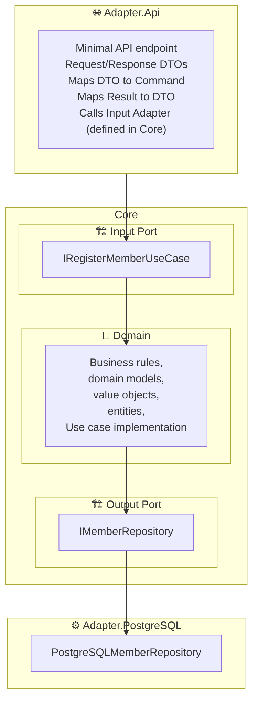
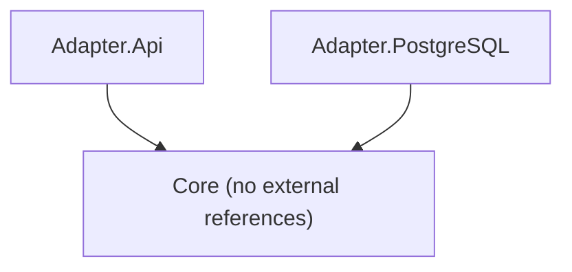

# 🧩 Exercise 01: Building the "Register Member" Use Case

Congratulations — you’ve officially inherited legacy code! 🎉  
Let’s make it shine again by implementing the **Register Member** use case using **Hexagonal Architecture** principles.

---

## 🎯 Goal

You’ll implement the `RegisterMember` use case by creating clean Input and Output Ports, Use Cases, and Adapters.  
This exercise introduces the fundamental flow of the architecture: **Input Port → Core → Output Port → Adapter**.

---

## 🧭 Your Mission, Should You Choose to Accept It...

Follow these steps to implement the **Register Member** use case:

1. **Create the Input Port**
   - Define the interface in `Core/InputPorts`.
   - Implement the use case logic in `Core/UseCases`.
   - Comment out or remove the legacy code. (Farewell, old friend. 👋)
   - The use case should handle the process of registering a new member.

2. **Create the API Adapter**
   - Add a new project: `Adapters/Adapter.Api`.
   - Implement a **Minimal API** endpoint that calls the `RegisterMember` use case through **dependency injection**.
   - This API acts as your **input adapter**.

3. **Create the Output Port**
   - Define the interface (e.g., `IMemberRepository`) inside `Core/OutputPorts`.
   - Implement the interface in a new project: `Adapters/Adapter.PostgreSQL`.
   - Make your domain entities navigable for EF and create the corresponding EF configuration.

4. **Adapter Communication (Temporary Exception)**
   - Normally, **adapters should never talk to each other** — they only depend on the Core.
   - For this exercise, you are allowed to let `Adapter.Api` reference `Adapter.PostgreSQL` **only** for dependency injection.
   - This is a **one-time exception** for simplicity.

5. **Persistence Note**
   - It’s fine to call `SaveChanges()` directly in your repository implementation — for now.  
     (Yes, we know... but you’ll fix that soon 😉)

6. **Unit Tests**
   - You’ll receive a **Core test project** using **NUnit**.
   - The tests should focus **only on Core logic** — no real database.  
   - Use an `Adapter.InMemoryData` implementation for your tests.  
   - Validate that your use case behaves correctly under different scenarios.

7. **Keep the Architecture Clean**
   - Each adapter must be its own project.
   - The Core must **not reference** any adapter or external library.
   - Dependencies always flow **inward**.
   - The API exposes the Core, but the Core doesn’t know the API exists.
   - 🚫 **Request and Response DTOs must never reach the Core** — they belong to adapters.  
     The Core should only deal with domain objects or input models (e.g., `RegisterMemberCommand`).
   - The API is responsible for mapping incoming DTOs to Core models and Core results back to DTOs.
   - Add one **Architecture.UnitTest** project using [`NetArchTest.Rules`](https://www.nuget.org/packages/NetArchTest.Rules/), and create 3 unit test to ensure:
       * `Core` does not have a reference to `Adapter.Api`.
       * `Core` does not have a reference to `Adapter.PostgreSQL`.
       * `Adapter.PostgreSQL` does not have a reference to  `Adapter.Api`.

---

## 🧩 Where the DTOs Live (and Die)

Before you start coding, visualize how the layers interact:

---

## 🧠 Key Takeaways

- **Input Port** lives in the **Core**. The API calls it — but it’s defined and implemented in the Core.  
- **Output Port** also lives in the Core but is implemented by adapters.  
- **Adapters** handle infrastructure: HTTP, EF, or external systems.  
- **Core** stays clean: no `[NotMapped]`, no EF, no framework dependencies.  
- Arrows always point **inward** — from Adapters to Core.

---

## 🎯 Dependency Flow

✅ **Rule of thumb:** All dependencies flow *toward the Core*.  
Adapters depend on the Core — the Core never depends on adapters.

---

## 🎬 Your Mission, Should You Choose to Accept It...

Your next mission is to **bring the legacy "Register Member" use case to life** using everything you’ve learned.

You’ll:
- Design ports.
- Write use cases.
- Create adapters.
- Build a minimal API.
- Wire up dependency injection.
- And prove it all works with unit tests.

💡 *This message will not self-destruct... but your old anemic domain might.* 😎

### Call the Sheriff! 🤠
When you finish, shout *“Code Review!”* to your friendly architecture sheriff for a full review to ensure your solution follows Hexagonal principles.
