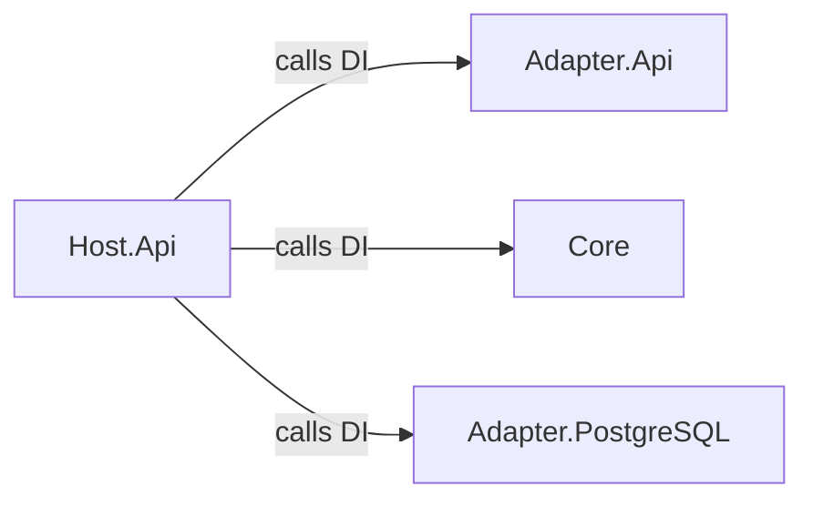

# 🧭 Exercise 02: Adding a Host Project

In the first exercise, your API directly called the PostgreSQL adapter.
Yes, it worked… but it **broke one of the golden rules of Hexagonal Architecture**:

> **Adapters should never reference each other.**

Now, it’s time to fix that by introducing a proper **Host project** — the conductor of your architectural orchestra. 🎻
Its job: bring harmony between the Core and the Adapters without ever touching the melody (business logic).

---

## 🎯 Goal

Your goal is to restructure your solution so the **Host.Api** project orchestrates all the dependencies and the application startup, while adapters remain blissfully unaware of each other.

Specifically, you will:

1. Introduce a **dedicated API Adapter** (`Adapters/Adapter.Api`) containing your Minimal API endpoints.
2. Add a **Host.Api** project responsible for:

   * Registering Core and Adapter dependencies.
   * Bootstrapping the Minimal API.
   * Running the whole application.
3. Ensure that **no adapter directly references another** — the Host will do all the wiring.

---

## 🏗 Example Structure

Here’s what your new architecture layout should look like:

```text
src/
 ├─ Core/                     # Domain, Use Cases, Ports
 ├─ Adapters/
 │   ├─ Adapter.Api/          # Minimal API endpoints
 │   ├─ Adapter.PostgreSQL/   # Persistence adapter
 └─ Host.Api/                 # The composition root (startup logic)
test/
```

This structure allows you to isolate each concern while keeping the entry point (Host) clean and dependency-driven.

---

## 🧩 Dependency Flow



✅ **Rule of thumb:** The Host is the **composition root** — it glues everything together.
Adapters never talk to each other; they communicate through the Core.

---

## 💡 Why This Matters

By introducing the Host:

* **Adapters remain isolated** — clean, swappable, and focused.
* **Core remains pure** — untouched by infrastructure details.
* **Host acts as the conductor** — orchestrating dependencies, not business logic.
* **The system becomes testable and modular** — each adapter can evolve independently.

In short, you’ve moved from a garage band to a symphony. 🎶

---

## 🧠 Key Takeaways

* The **Host** project is your composition root.
* The **API Adapter** only handles input (requests, DTOs, mapping).
* The **PostgreSQL Adapter** only handles output (persistence).
* The **Core** knows nothing about either.
* Dependencies flow **inward**, and only the Host connects them.

---

## 🎬 Your Mission, Should You Choose to Accept It...

Refactor your existing project to introduce the **Host.Api** layer.

You will:

* Move all dependency injection logic to the Host.
* Ensure the API and PostgreSQL adapters never reference each other.
* Keep your Core pure and framework-agnostic.
* Verify everything still works via unit tests.
* Add one unit test to **Architecture.UnitTest** project:
       * `Adapter.Api` does not have a reference to  `Adapter.PostgreSQL`.

💡 *This message will not self-destruct, but your adapter dependencies might...* 😎