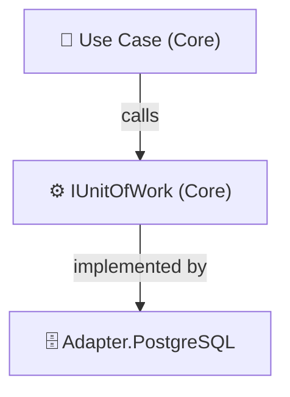

# 🔄 Exercise 03: Implementing the Unit of Work Pattern

The training wheels are coming off.
Until now, your repositories have been calling `SaveChanges()` directly, and that’s fine… for small demos.

When you call `SaveChanges()` in multiple repositories can cause partial updates or inconsistent states. To fix this, we’ll **centralize transaction control** using the **Unit of Work (UoW)** pattern:

one transaction to commit them all. 💍

---

## 🎯 Goal

The goal of this exercise is to centralize transaction control across multiple repositories so that your changes are **atomic** — either *everything* saves, or *nothing* does.

You’ll abstract away your data layer logic using a `UnitOfWork` interface that your Core can depend on safely.

---

## 🧠 Concept Recap

In **Hexagonal Architecture**, persistence details belong to Adapters, but the **coordination of persistence** (when to save, when to rollback) belongs in the **Core** use cases.

The **Unit of Work** pattern:

* Tracks all the entities that are being created, updated, or deleted.
* Coordinates multiple repositories under one transaction boundary.
* Commits or rolls back all changes in one go.

---

## 🧩 Implementation Steps

### 1. Define the Interface in the Core

Create `IUnitOfWork` inside `Core/OutputPorts`.
This interface represents the contract that every persistence layer must fulfill.

```csharp
public interface IUnitOfWork
{
    Task AddAsync<T>(T entity) where T : class;
    Task UpdateAsync<T>(T entity) where T : class;
    Task DeleteAsync<T>(T entity) where T : class;
    Task<int> CommitAsync();
}
```

This allows the Core to operate on persistence without knowing if it’s EF, MongoDB, or something else entirely.

---

### 2. Implement the Interface in PostgreSQL Adapter

In `Adapters/Adapter.PostgreSQL`, implement the interface in your `AppDbContext`:

```csharp
public class AppDbContext : DbContext, IUnitOfWork
```

Register it in your dependency injection configuration:

```csharp
services.AddScoped<IUnitOfWork, AppDbContext>();
```

Now your repositories don’t need to call `SaveChanges()` — they just rely on the Unit of Work.

---

### 3. Update Your Use Case

In your Core Use Cases, inject `IUnitOfWork` instead of relying directly on a specific DbContext or repository method for saving.

```csharp
await _unitOfWork.AddAsync(newMember);
await _unitOfWork.CommitAsync();
```

This ensures that all operations within a use case occur inside a single, consistent transaction.

---

## ⚙️ Why Not Just Use DbContext Directly?

Because we’re building **architecture**, not quick fixes. 😉

### 1. Abstraction and Testability

* The Core must not depend on EF Core.
* The interface lets you replace EF with a fake implementation for unit testing.

### 2. Cross-Technology Consistency

* EF Core supports transactions easily, but MongoDB or CosmosDB may not.
* The Unit of Work pattern provides a **consistent abstraction** no matter the underlying persistence technology.

---

## 🧠 Architecture Overview

Here’s how the new flow looks conceptually:



The Core defines the contract, and the PostgreSQL adapter implements it — perfectly aligned with Hexagonal principles.

---

## 🔑 Key Takeaways

* The **Unit of Work** centralizes transaction control.
* **Repositories** become lightweight — they no longer call `SaveChanges()`.
* The **Core** stays persistence-agnostic.
* You gain **testability**, **consistency**, and **atomicity** across multiple repositories.
* This pattern lays the groundwork for more advanced concepts like **CQRS** or **Event Sourcing**.

---

## 🎬 Your Mission, Should You Choose to Accept It...

Your mission, dear architect, is to **bring transactional order to your system**.

You will:

* Create the `IUnitOfWork` interface and its implementation.
* Refactor your use cases to depend on it.
* Update your tests to confirm that operations are atomic.
* Add one unit test to **Architecture Unit Test** :
  * Repository interfaces in Core only expose methods that begin with "Get" (e.g., `GetByIdAsync`, `GetAllAsync`).

> You’ve brought balance to the persistence layer — one transaction to commit them all, one transaction to find them,
> one transaction to rule them all, and in consistency bind them. ⚔️
